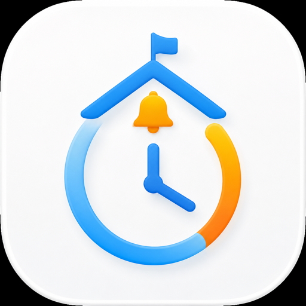

# Time Left

macOS 13 이상에서 동작하는 SwiftUI 메뉴바 카운트다운 앱입니다. 기본 목표는 매주 금요일 오후 2시 20분의 하교 시간이며, 메뉴바에서 프리셋을 바꾸거나 설정 창에서 원하는 목표를 지정할 수 있습니다. 메뉴바는 `2h 20m`처럼 남은 시간만 표시하며, 클릭한 메뉴에서 목표 이름과 상세 시간을 확인할 수 있습니다.



## 기능

- 메뉴바에 `2h 20m` 형식의 카운트다운 표시 및 클릭 메뉴의 상세 목표 정보
- 하교, 올해, 사용자 지정 빠른 프리셋
- 특정 요일/시간(매주 반복 또는 한 번만), 오늘의 시간, 특정 날짜/시간, 올해 종료, 사용자 지정 날짜
- 자동, 초, 분, 시간, 일, 주, 년 단위 표시
- 목표 이름과 표시 단위의 영구 저장
- Dock 아이콘 없이 메뉴바에서만 실행되는 앱

## 실행

1. `TimeLeft.xcodeproj`를 Xcode 14 이상에서 엽니다.
2. `Time Left` 스킴을 선택합니다.
3. macOS 13 이상을 대상으로 빌드하고 실행합니다.

별도의 Swift Package나 외부 라이브러리는 사용하지 않습니다. 앱 설정은 macOS의 `UserDefaults`에 저장됩니다.

## DMG 배포

Release 빌드한 앱을 DMG로 패키징합니다.

```bash
xcodebuild -project TimeLeft.xcodeproj -scheme 'Time Left' -configuration Release -derivedDataPath build CODE_SIGNING_ALLOWED=NO build
./scripts/create-dmg.sh "$(pwd)/build/Build/Products/Release/Time Left.app"
```

생성된 `dist/Time-Left-<version>.dmg`를 GitHub의 **Releases** 항목에 첨부합니다. 공개 배포에서는 Developer ID로 앱을 서명하고 Hardened Runtime을 켠 뒤, DMG를 Apple notarization에 제출해 ticket을 staple해야 Gatekeeper 경고 없이 설치할 수 있습니다.

## 기본 동작

처음 실행하면 매주 금요일 14:20을 목표로 합니다. 목표 시간이 지나면 반복 설정이 켜져 있을 때 다음 주 목표로 자동 이동하며, 반복되지 않는 목표는 메뉴에서 완료 상태로 표시됩니다.
